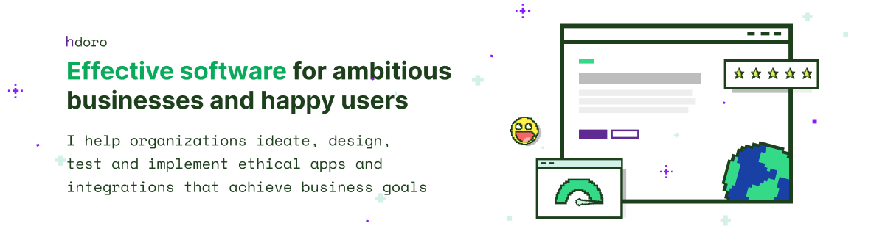

# 🌻 I'm Henrique, here to advance social and environmental causes with software

💻 _Full-stack Freelance Engineer with 10+ years of experience_

I build digital products for ambitious organizations. Full-stack development is where I shine most, but I also speak business and design. My experience spans everything from product strategy and marketing, to UX design and integrations development.

## Highlight of preferred tools

| Frontend | Backend | Design & Tools |
|:---------|:--------|:---------------|
|  React |  Effect TS | Product Strategy |
|  NextJS |  Gel DB | Design Sprints & UI/UX |
|  TypeScript | APIs & integrations |  Figma |

## Let's Connect!

I'm open to new clients. You'll especially love my work & grit if you are developing businesses or social projects with a focus on social justice, farming and/or the environment.

 henrique@hdoro.dev /  [hdoro.dev](https://hdoro.dev) /  [@hdoro](https://www.linkedin.com/in/hdoro/) /  [@hdoro.dev](https://bsky.app/profile/hdoro.dev)

## Some of my best writing

- [Learn GROQ in 45 minutes](https://hdoro.dev/learn-groq) interactive crash course on the GROQ query language
- [Learn Typescript by writing Javascript](https://hdoro.dev/learn-typescript-trick)
- [How I'm writing & maintaining complex regular expressions (RegEx)](https://hdoro.dev/building-maintainable-regex)

## Featured project

🥕 [Gororobas](http://github.com/hdoro/gororobas) is my current attempt at bridging my passion for Agroecology and software. Currently it's a collaborative wiki and note-taking platform on all-things planting and cooking. Winner of Gel Data 2024 hackathon (form. EdgeDB).
